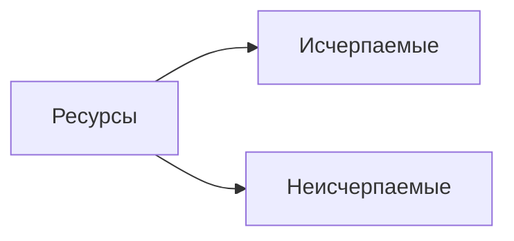
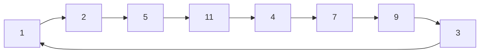
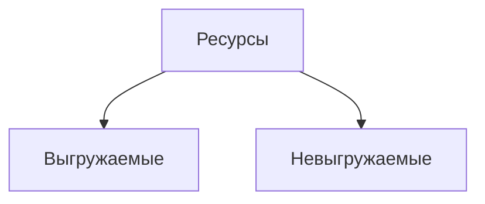

---
next:
  text: 'К содержанию'
  link: '/os/os_index'
prev: false
---

# Понятие операционной системы

*Операционной системой* называется  набор программ и данных(таблиц, т.е. структурированных данных), позволяющих общаться с аппаратными средствами вычислительной системы и  предоставляющих интерфейс для работы с системой и прикладным программным обеспечением

Попробуем нарисовать компьютер

Какими ресурсами управляет операционная система?

- Процессорное время;
- ОЗУ;
- Владение устройствами ввода/вывода;
- Сетевая интерфейсная карта;
- Программы;
- Данные;

Пример неисчерпаемого ресурса (тут ресурс - программа)

Также ресурсы можно поделить на выгружимые и невыгружаемые

Выгружаемые - ресурс, который можно отнять у процесса. Пример: ресурсы процессора
Невыгружаемые - ресурс, который нельзя отнять от процесса.  Пример: Принтер

Операционная система предоставляет пользователю следующие функции:

1. Распределение и перераспределение оперативной памяти
2. Управление устройствами ввода вывода
3. Управление процессами и потоками
4. Распределение внешней памятью
5. Обработка прерываний
6. Учет и контроль
7. Предоставление интерфейса для доступа к ресурсам
8. Предоставление инструментов для разработки программного обеспечения

Функции 1-6 предоставляет ядро ОС.

