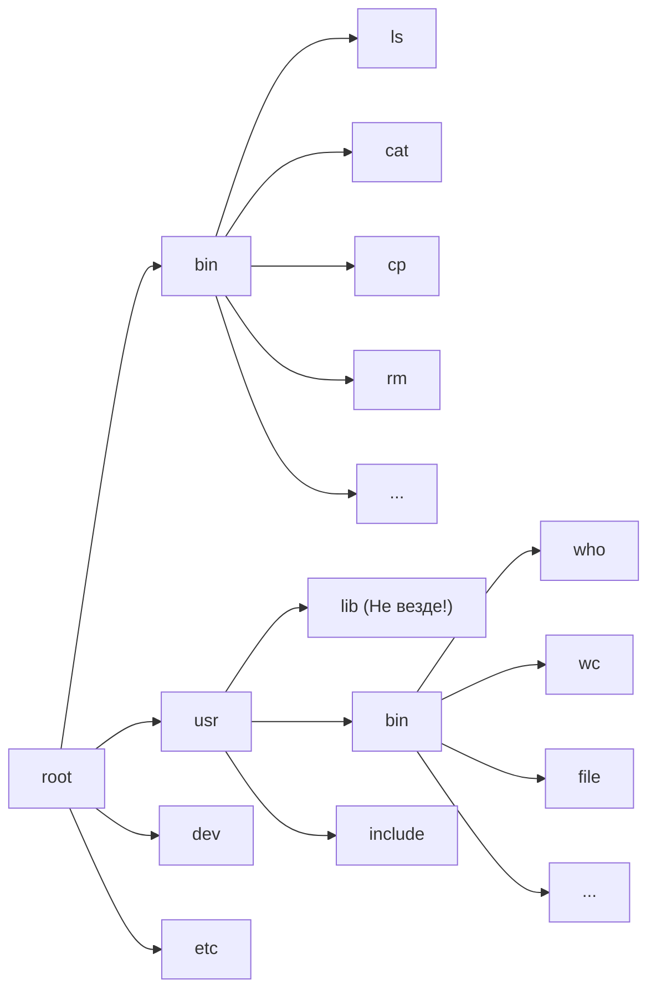

---
next:
  text: 'К содержанию'
  link: '/os/os_index'
prev: false
---

# Системные вызовы

**Системный вызов** - это функция, ориентированная на работу с ресурсами вычислительной системы.

*Примечание*. Ее код находится в ядре ОС, которое в свою очередь всегда находится в оперативной памяти.

Рассмотрим системные вызовы:

`int system(char *com)`

- Эта команда запускает новый процесс в рамках  потока и приостанавливает выполнение текущей программы  до выполнения программы.
- *Аргументы*:
  - `char *com` - указатель на командную строку
- *Что возвращает?* - 1/-1 в случае успешного или неуспешного, соответственно, выполнения программы
- *Примеры*:

```C
// Копируем текст из a.c. в b.c
system("cp a.c b.c");
// Запускаем из текщей директории программу
system("./a.exe");
```

- *Примечание*: Эта команда обычно не используется в системных утилитах, так как она множит процессы

`int execl(char *path, char *arg_0, ..., char *arg_n, NULL)`

- *Что делает эта команда?* - Замещает процесс, в котором работала команда, собой (т.е. программа досрочно заканчивает свое выполнение)
- *Аргументы*:
  - `char *path` - полное название команды
  - `char *arg_0` - нулевой аргумент командной строки(т.е. сама команда)
  - `char *arg_1, ...,  char *arg_n` - аргументы командной строки(аргументы команды)
  - `NULL` - пишется, чтобы показать, что больше аргументов не будет
- *Что возвращает?* - $-1$ в случае  ошибки в ходе выполнения программы (иного ыв)
- *Примеры*:

```C
// ./a.exe
execl("./a.exe", "a.exe", NULL);
//cp a.c b.c
execl("/bin/cp", "cp", "a.c", "b.c", NULL);
```

- *Примечание*: Эта команда обычно не используется в системных утилитах, так как она множит процессы

**Файловая система Linux**



`int fork(void)` / `int vfork(void)`

- Функция fork() вызывает создание нового процесса.  Новый процесс (дочерний процесс) является точной копией вызывающего процесса (родительского процесса), за исключением одного следующего:
  - Дочерний процесс имеет уникальный идентификатор процесса.
  - Дочерний процесс имеет другой идентификатор родительского процесса (т. е. идентификатор процесса родительского процесса).
  - У дочернего процесса есть своя копия дескрипторов родительского процесса. Эти дескрипторы ссылаются на одни и те же базовые объекты, так что например, указатели на файлы в файловых объектах являются общими.
- Возвращает 0 в случае, если не удалось создать дочерний процесс, иначе PID отца.

*Примеры*:

```C
//...
int p = fork()
if (p > 0) {
	/* Это процесс-отец */
} else {
	if(p == 0) {
	/* Это процесс-сын */
	} else {
		/* Произошла авария */
	}
}
//...
```

*Примечание*: Нужно быть аккуратной с этой командой в бесконечными цикла, так как можно создать fork-бомбу.

`int wait(int* s)`

- Системный вызов используется в процессе-отце для ожидания(и дальннейшего завершения) процесса-сына.
- Возвращает индентификатор завершившегося процесса сына(`pid`).
- В свой единственный аргмуент записывает причину завершения(гибели) процессса сына

```C
//...
int s;
//...
if(fork() == NULL) {
    execl("/bin/ls", "ls", NULL);
}
else {
    wait(&s);
}
```

В UNIX системах процесс модет быть завершен 2 способами:

- `_exit()` (Также есть библиотечный вариант этой программы: `exit()`)
- сигнала (Их более 40-50, бывают внешние/внутренние сигналы. Тут можно найти [примеры](https://ru.wikipedia.org/wiki/%D0%A1%D0%B8%D0%B3%D0%BD%D0%B0%D0%BB_(Unix)))

`int waitpid()`
В аргументе может быть либо номер сигнала, либо аргумент функции `exit()`


**Примечание**. Нумерация сигналов идет с 1.

`int _exit(int arg);`

- Системный вызов `_exit()` завершает процесс, в рмках которого он запущен. При этом он закрывает все открытые данным процессом файлы.
- `int exit(int arg)` - делает тоже самое, но нужно подключать `#include <stdlib.h>`. В отличие от системного вызова `exit()`, выталкивает буфера ввода/вывода

```C
//...
printf("Hello ");
write(1, "my friend");
_exit(1); // my friend
//...
printf("Hello ");
write(1, "my friend");
exit(1); // my friend Hello
```

*Примечание*: Только `write()` и `read()` работают без буферизации

## Системные вызовы для работы с файлами

При создании любого процесса операционная система автоматически открает для него 3 файла:

0. `dev/tty` - открыт для чтения (файл стандартного ввода/потока; с ним работают все функции на вывод)
1. `dev/tty` - открыт для записи (файл стандартного вывода; с ним работают все функции на ввод)
2. `dev/tty` - открыт для чтения и записи (файл стандартного протокола; с ним работают функции, работающие с функциями ошибок)
3. … (далее идут дескрипторы отктых в процессе файлов)
*Примечание*: Тут `tty` означает терминал.

Такая запись называется файловым дескриптором открытого файла (номер дескриптора 0,1,2 в зависимости от того, что делает сам дескриптор).

`int open(char* name, int flag)`

- Эта функция позволяет открыть уже существующий файл ( отдельные макросы позволяютсоздать в противном случае файл)
- Аргументы:
  - `char *name` - имя файла(если записано неполное имя файла, то файл ищется в текущей директории).
  - `int flag` - режим открытия файла
- Также вместо использования этой функции можно испольовать макросы из `fcntl.h`: `O_READONLY`, `O_WRONLY`, `O_RDWR`, `O_CREATE`
- Системный вызов `open()` возвращает номер первой свободной записи в таблице пользовательских дескрипторов открытых файлов процесса.
- В случае, если такого файла нету, то `open()` вернет `-1`; (Так же если у нас нет прав, также вернется `-1` )

```C
int file;
// ...
close(1);
open("file.txt");
```

Вот так будет выглядеть таблица дескрипторов:

| 0 | dev/tty         |
|---|-----------------|
| 1 | a.txt           |
| 2 | /dev/tty (зап.) |

То есть. весь стандартный вывод пойдет в файл `a.txt`.

`int creat(char* name, int mode)`

- Создает файл и одновременно открывает его на запись. При этом, если указан неполное имя файла, файл создается в текущей директории.
- Если у пользователя нет прав на создание файла в директории, ‘creat()’ не создаст файл.
- Аргументы:
  - `char* name` - имя файла;
  - `int mode` - режим создания файла;
*Примечание*. Многие не считают его системным вызовом, поскольку состоит из нескольких.

