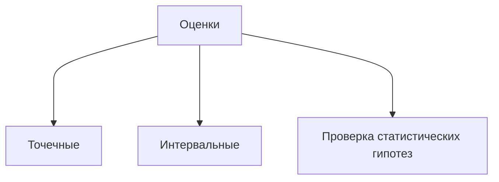

---
next:
  text: 'К содержанию'
  link: '/statistics/statistics_index'
prev: false
outline: deep
---

# Введение в Статистику

**Определение 1.** $\{F_{\theta}(x) \mid \theta \in \Theta\}$ - *параметрическое семейство*, где $\theta$ - параметр

**Определение 2.** Пусть $\xi$ - некоторая случайная величина. Тогда *наблюдением* мы будем назвать любое значение, которое она приняла в результате эксперимента

**Определение 3.** Набор независимых одинаково распределенных СВ мы будем назвать *выборкой* (набор - конечный)

**Определение 4.** *Реализацией выборки* объема n назовем n наблюдений за одной СВ (или n одинаковых СВ)

**Определение 5.** Множество всех реализацией выборки с определенной на нем сигм алгеброй измеримых подмножеств называется *выборочным пространством*
